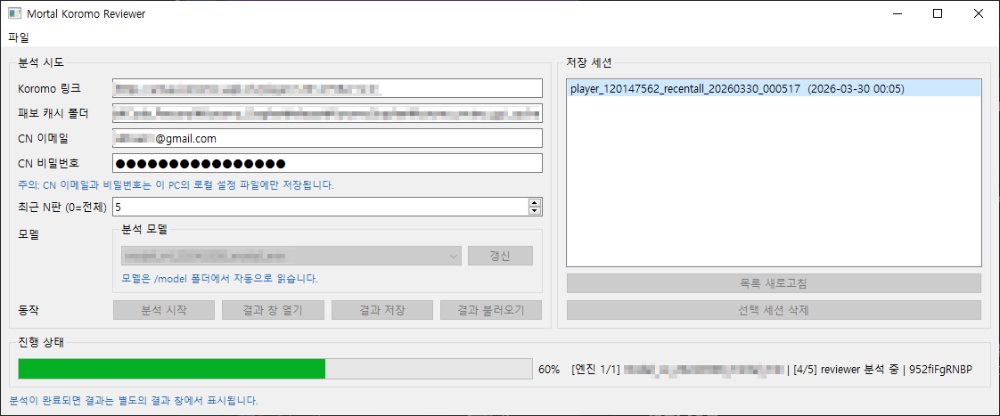
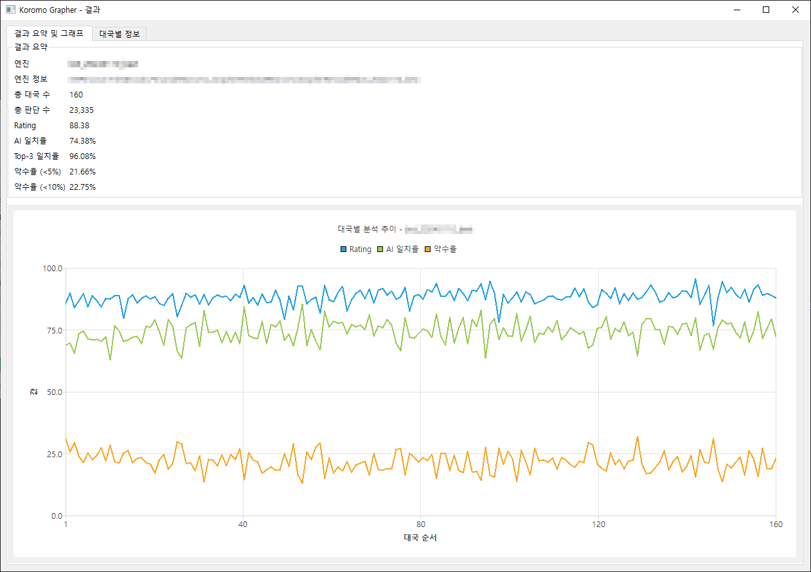
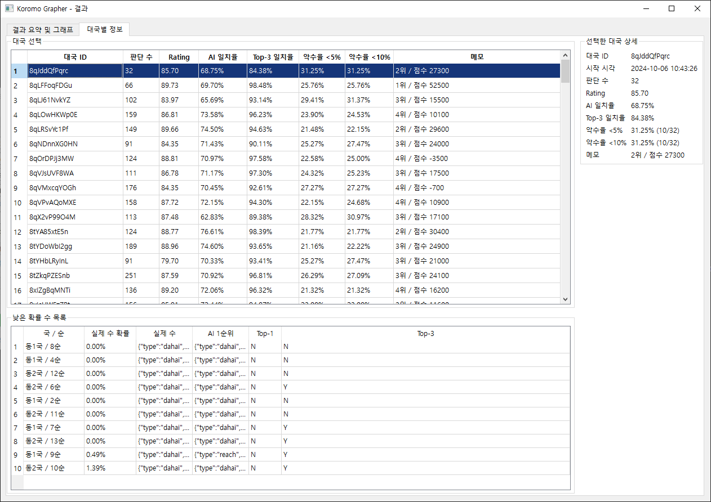

# Koromo Grapher

<details>
<summary>이미지</summary>



</details>

- [Koromo](http://amae-koromo.sapk.ch/) 링크 기준으로 Mahjong Soul 대국을 내려받아, 로컬 Mortal 엔진으로 복기 및 통계를 보여주는 도구입니다.
- 치터 구분 / 유저 성적 추이 확인 등의 목적으로 개인 용도로 제작하였으며, 제작에 `OpenAI Codex`를 사용했습니다.


## 사용법

1. Koromo 플레이어 링크 입력
2. CN 이메일 / 비밀번호 입력
3. `model` 폴더 안의 모델 선택
4. 최근 `N`판 입력 후 분석 시작 (`0` 입력 시 전체 분석)
5. 결과 창에서 요약 / 그래프 / 대국별 정보 확인

## 설명

### 진행 순서
1. `Koromo`를 통해 특정 유저의 전적 탐색 및 대국 목록 추출
2. `Majsoul API`를 통한 패보 데이터 다운로드
3. `tenhou` 로그로 변환 후 로컬 모델을 통한 분석
### 계정 관련
1. API를 통한 대국 데이터를 받기 위해, 중국서버 계정이 필요합니다.
2. 계정은 로컬에 저장됩니다. (경로 : `.\koromo_review_gui_cache\local_settings.json`)
### 모델 관련
1. 본 프로젝트에는 모델 데이터가 포함되지 않습니다.
2. 따로 준비한 모델은 `.\model\[표시 될 모델명]\mortal.pth`와 같은 형태로 넣어야 합니다.
3. 사용한 모델에 따라, 원본 Mortal Reviewer와 크게 상이할 수 있습니다.


## 빌드

```powershell
powershell -ExecutionPolicy Bypass -File .\build_koromo_grapher_exe.ps1
```

### Full build setup

```powershell
git submodule update --init --recursive

pip install -r requirements.txt

cd .\_external\amae-koromo-scripts
npm install --legacy-peer-deps --ignore-scripts
cd ..\..

cd .\_external\mjai-reviewer
cargo build --release
cd ..\..


powershell -ExecutionPolicy Bypass -File .\build_koromo_grapher_exe.ps1
```

## 실행
- Release build: `release\KoromoGrapher\KoromoGrapher.exe`
- Portable launch: `launch_koromo_reviewer.vbs`

## 참고 / 포함 리포지토리

- [**Equim-chan/Mortal**](https://github.com/Equim-chan/Mortal?) (`AGPL-3.0`)
- [Equim-chan/mjai-reviewer](https://github.com/Equim-chan/mjai-reviewer) (`Apache-2.0`)
- [SAPikachu/amae-koromo](https://github.com/SAPikachu/amae-koromo) (`MIT`)
- [SAPikachu/amae-koromo-scripts](https://github.com/SAPikachu/amae-koromo-scripts) (`MIT`)
- [MahjongRepository/mahjong_soul_api](https://github.com/MahjongRepository/mahjong_soul_api)
- [Equim-chan/tensoul](https://github.com/Equim-chan/tensoul) (`MIT`)
